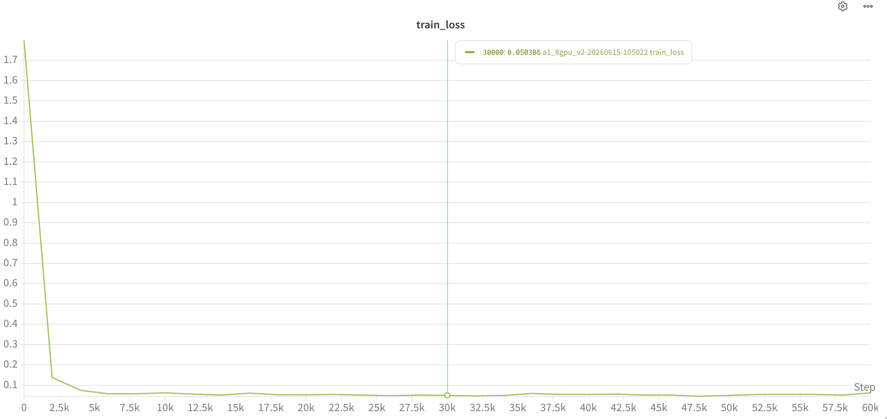
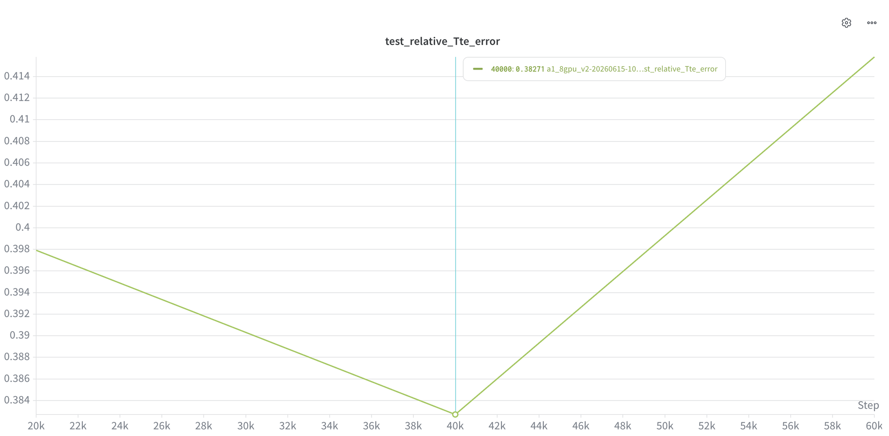
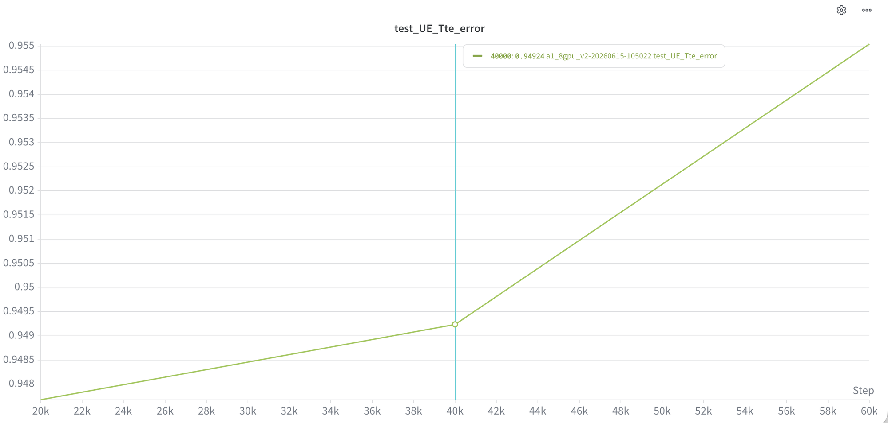
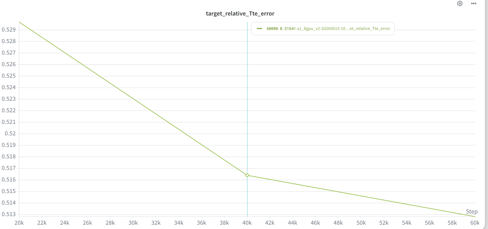
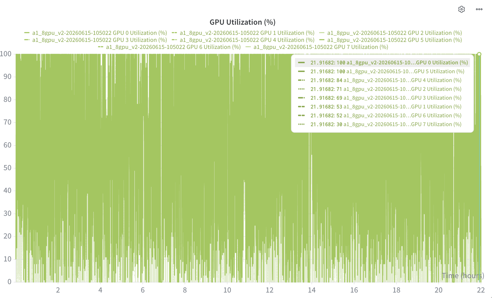
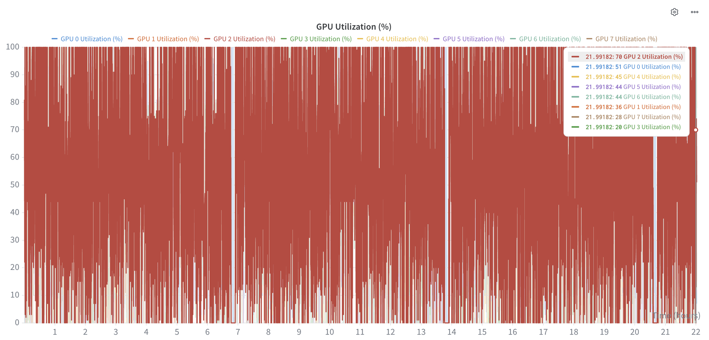
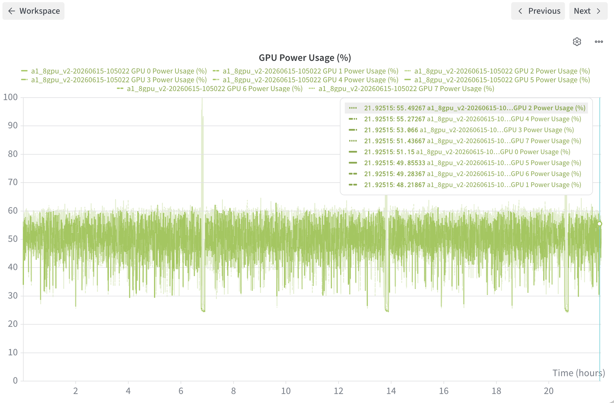
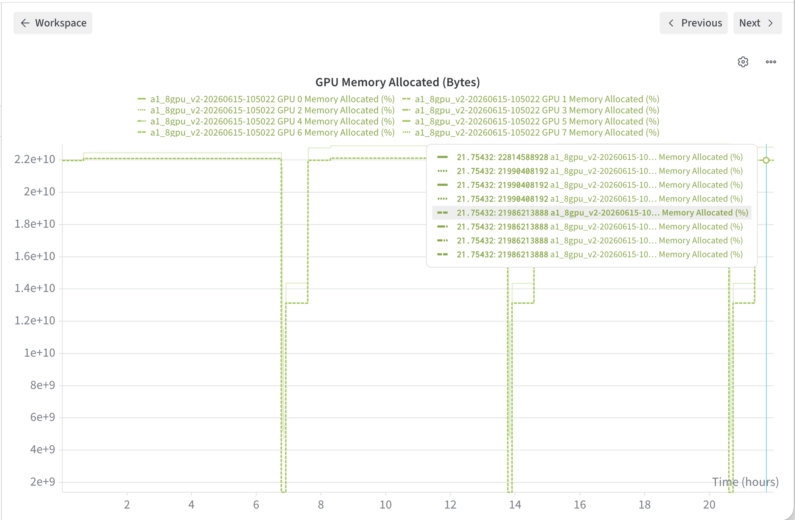

# MetaGen 模型训练学习笔记

**实验名称**: `a1_8gpu_v2`  
**报告日期**: 2026-06-16  
**训练服务器**: 8× NVIDIA A40 (45 GB VRAM)  
**论文**: *Inverse Design of Diffractive Metasurfaces Using Diffusion Models* (Hen et al., 2025, ACS Photonics)  
**论文链接**: https://arxiv.org/abs/2506.21748

---

## 一、训练目标

复现论文中 MetaGen 扩散模型在 **a1 数据集**上的训练过程。

### 1.1 论文核心方法

MetaGen 是一个**条件扩散模型**，用于超表面（metasurface）的逆向设计：

```
输入：目标远场散射图案 T (空间功率分布) + 工作波长 λ
输出：超表面元原子几何结构（二值拓扑图 x + 高度 h）
```

训练流程：
1. 使用 RCWA 仿真器生成 150 万条 `(结构, 散射)` 配对数据
2. 训练 SongUNet 扩散模型，学习从噪声中恢复结构，条件为散射图案 + 波长
3. 推理时从纯噪声出发，通过去噪过程生成满足目标散射的结构

### 1.2 本次训练目标

| 项目 | 目标 |
|------|------|
| 数据集 | a1（SiO₂，TE-only，periodicity=1.9µm）|
| 模型 | SongUNet + EDMPrecond，128 channels，4 blocks |
| 训练步数 | 3,000,000 步 |
| 目标指标 | `test_relative_Tte_error` ≈ **0.1012**（论文 Table 4 报告值）|

### 1.3 论文 Table 4 参考结果

| 方法 | A1 | A2 | A3 |
|------|----|----|----|
| CVAE | 0.5326 ± 0.2718 | 0.5951 ± 0.2017 | 0.6266 ± 0.1699 |
| WGAN-GP | 0.2857 ± 0.1679 | 0.4655 ± 0.1725 | 0.5323 ± 0.1535 |
| **MetaGen (论文)** | **0.1012 ± 0.0926** | 0.1658 ± 0.0883 | 0.2725 ± 0.1255 |

> 注：论文评估使用 N=500 测试样本，无 RCWA 引导采样。

---

## 二、训练简介

### 2.1 环境配置

| 项目 | 配置 |
|------|------|
| 硬件 | 8× NVIDIA A40 (45 GB VRAM) |
| 启动方式 | `python` 单进程 + `nn.DataParallel` |
| 并行框架 | `nn.DataParallel`（模型复制到 8 GPU，梯度在 GPU0 汇总）|
| 有效批大小 | 256（每 GPU 32 样本）|
| 优化器 | AdamWScheduleFree (lr=1e-4, wd=0) |
| LR 调度 | 线性 warmup 5000 步 → 恒定 LR |
| EMA | 半衰期 1000 步，warmup ratio 0.1 |
| CFG | label_dropout=0.1 |
| 数据加载 | `num_workers=0`（避免 LMDB fork 死锁）|

### 2.2 训练命令

```bash
nohup env CUDA_VISIBLE_DEVICES=0,1,2,3,4,5,6,7 \
  python diffusion/train.py \
  --name a1_8gpu_v2 \
  --data_cfg a1 \
  --batch_size 256 \
  --log \
  > a1_8gpu_v2_train.log 2>&1 &
```

### 2.3 关键观测指标

#### 2.3.1 Train Loss



| Step | Train Loss | 说明 |
|------|------------|------|
| 0 | ~1.75 | 随机初始化 |
| 2k | ~0.14 | 快速下降 |
| 5k | ~0.07 | 进入平台期 |
| 30k | **0.050306** | 当前最低 |
| 60k | ~0.063 | 轻微波动 |

> EDM Loss 为加权去噪 MSE，绝对数值不直接对应物理精度。0.05 的 loss 表示模型已学会基本的去噪映射，但精细结构仍需更多训练。

#### 2.3.2 test_relative_Tte_error（分布内测试误差）



| Step | test_relative_Tte_error | 说明 |
|------|------------------------|------|
| 20k | 0.39791 | 首次评估 |
| 40k | **0.38271** | 当前最低 |
| 60k | ~0.416 | 反弹（采样方差）|

> 评估使用 100 个测试集样本 + 扩散采样 + RCWA 仿真。由于采样随机性，该指标存在 ~0.03 的波动属正常现象。论文最终目标 ≈ 0.10。

#### 2.3.3 test_UE_Tte_error（均匀性误差）



| Step | test_UE_Tte_error | 说明 |
|------|-------------------|------|
| 20k | ~0.948 | 首次评估 |
| 40k | 0.94924 | 几乎无变化 |
| 60k | ~0.955 | 微升 |

> UE（Uniformity Error）衡量衍射斑的均匀性：`(max-min)/(max+min)`。值接近 1 表示均匀性差，模型尚未学会控制衍射能量分布。

#### 2.3.4 target_relative_Tte_error（OOD 目标误差）



| Step | target_relative_Tte_error | 说明 |
|------|---------------------------|------|
| 20k | 0.52929 | 首次评估 |
| 40k | 0.51641 | 持续下降 |
| 60k | ~0.513 | 持续改善 |

> Target 指标使用 OOD（Out-Of-Distribution）理想图案评估（棱镜、分束器、十字形等），比 test 更难。当前呈稳定下降趋势，说明模型正在逐步学会泛化到未见过的目标模式。

#### 2.3.5 指标汇总对比

| 指标 | 20k | 40k | 60k | 论文目标 |
|------|-----|-----|-----|---------|
| `train_loss` | 0.054 | 0.050 | 0.063 | — |
| `test_relative_Tte_error` | 0.398 | **0.383** | 0.416 | **0.101** |
| `test_UE_Tte_error` | 0.948 | 0.949 | 0.955 | — |
| `target_relative_Tte_error` | 0.529 | 0.516 | **0.513** | — |

---

## 三、训练数据分析

### 3.1 metagen_a1 数据集概况

| 项目 | 数值 |
|------|------|
| 总记录数 | **1,500,000 条** |
| 子数据集数量 | 6 个（每波长一个）|
| 每子集样本数 | 250,000 条 |
| 存储空间 | ~11.16 GB |
| 训练/测试划分 | 90% / 10%（代码中 `random_split`）|

**波长分布**（6 个子数据集，各占 1/6）：

| 波长 (µm) | 文件名 | 大小 |
|-----------|--------|------|
| 0.850 | `lmdb_dataset_lam0.850` | 1.86 GB |
| 0.900 | `lmdb_dataset_lam0.900` | 1.86 GB |
| 0.950 | `lmdb_dataset_lam0.950` | 1.86 GB |
| 1.000 | `lmdb_dataset_lam1.000` | 1.86 GB |
| 1.050 | `lmdb_dataset_lam1.050` | 1.86 GB |
| 1.100 | `lmdb_dataset_lam1.100` | 1.86 GB |

### 3.2 物理配置（cfg_a1）

| 配置项 | 值 | 物理含义 |
|--------|-----|---------|
| 材料（衬底/结构） | SiO₂ / SiO₂ | 全介质超表面 |
| 周期 (periodicity) | 1.9 µm | 元原子重复单元尺寸 |
| 分辨率 | 64 × 64 像素 | 拓扑图离散化精度 |
| RCWA 阶数 | 7 | 仿真精度（19×19 衍射阶矩阵）|
| 波长范围 | 0.850 ~ 1.100 µm | 近红外波段 |
| 厚度（heights） | [0.75, 1.45] µm | 结构高度范围 |
| 散射模式 | 仅 TE 透射 | `use_t_only=True`, `use_te_only=True` |
| 信息透射阶数 | 3×3 = 9 阶 | `info_t_orders=3`，覆盖 ±1 阶衍射 |
| 目标 ROI 阶数 | 3×3 | `roi_t_orders=3` |
| 平均总透射率 | 0.92 | `mean_total_t=0.92` |

### 3.3 LMDB 单样本原始数据结构

每条 LMDB 记录通过 `pickle` 序列化，包含：

```python
{
    'name'       : 'sample_{idx}_h{h:.3f}_lam{λ:.3f}',  # str
    'layer'      : np.ndarray,    # 二值拓扑结构（0 或 1）
    'lvec'       : np.ndarray,    # 波长条件（如 [0.850]）
    'h_original' : np.ndarray,    # 结构厚度（如 [1.204] µm）
    'h'          : np.ndarray,    # 归一化厚度（映射到 [-1, 1]）
    'Tte'        : np.ndarray,    # TE 透射系数 [19×19]
    'Rte'        : np.ndarray,    # TE 反射系数 [19×19]
    'Ttm'        : np.ndarray,    # TM 透射系数 [19×19]（a1 中不使用）
    'Rtm'        : np.ndarray,    # TM 反射系数 [19×19]（a1 中不使用）
}
```

### 3.4 DataLoader 数据提取与转换流程

数据提取在 [`MetaLensDatasetLMDB.__getitem__()`](file:///Users/qp/workspace/metagen/data/lmdb_dataset.py#L139-L170) 中完成，分为**主体（layer）**和**条件（scattering）**两部分：

#### 主体（layer）— 模型要生成的目标

```python
# 1. 读取二值拓扑图 → float32 tensor
layer = ToTensor(sample['layer']).to(torch.float32)

# 2. 归一化到 [0, 1]
layer = normalize01(layer)

# 3. 拼接高度通道：h_normalized 填充为与 layer 同尺寸
h_normalized = h_original / max(heights)  # 标量 → 常量图
layer_output = torch.cat((layer, h), dim=-3)  # [2, 64, 64]
```

| 张量 | Shape | 数据类型 | 说明 |
|------|-------|---------|------|
| `layer` 通道 0 | [64, 64] | float32 | 归一化二值拓扑结构（0=空气, 1=SiO₂）|
| `layer` 通道 1 | [64, 64] | float32 | 归一化高度（常量填充，值 ∈ [0.52, 1.0]）|
| **合并** | **[2, 64, 64]** | float32 | 扩散模型的去噪目标 |

#### 条件（scattering）— 引导生成的条件向量

```python
# 1. 从 19×19 RCWA 输出中裁取中心 3×3 区域
Tte = crop_around_center(sample['Tte'], info_t_orders=3).flatten()  # [9]

# 2. a1 仅使用 Tte（Rte/Ttm/Rtm 被 mask 为 0）
# 3. 拼接波长
scattering = torch.cat([Tte, λ], dim=-1)  # [10]
```

| 分量 | 维度 | 来源 | 物理含义 |
|------|------|------|---------|
| `Tte[0:9]` | 9 | `crop_around_center(Tte_19x19, 3).flatten()` | 中心 3×3 透射强度（±1 阶衍射）|
| `λ[9]` | 1 | `sample['lvec']` | 工作波长（µm）|
| **合并** | **10** | — | 条件标签向量 |

> **标签维度公式**：`label_dim = num_T × info_t_orders² + num_R × info_r_orders² + 1`  
> a1: `1 × 3² + 0 × 5² + 1 = 10`

#### 数据增强

| 增强方式 | 实现 | 作用 |
|---------|------|------|
| 循环移位（cyclic shift） | `torch.roll(layer, (h_shift, w_shift))` | 模拟周期性边界条件，增强平移不变性 |
| 随机 mask | `get_random_scattering_mask()` | 随机屏蔽散射分量（a1 仅 Tte，max_masked=0，实际不 mask）|

#### 训练时 DataLoader 最终输出

```python
sample_dict = {
    'layer'       : float32[2, 64, 64],   # 主体（去噪目标）
    'scattering'  : float32[10],           # 条件（引导向量）
    'h'           : float32,               # 归一化高度
    'h_original'  : float32,               # 原始高度
    'lvec'        : float32,               # 波长
    'per'         : float,                 # 周期
    'mask'        : float32[4],            # 散射分量 mask
    'augments'    : tuple(int, int),       # 循环移位偏移量
}
```

在 [`DiffusionTrainer.do_forward()`](file:///Users/qp/workspace/metagen/diffusion/diffusion_trainer.py#L92-L94) 中：

```python
layer, scattering = sample['layer'].cuda(), sample['scattering'].cuda()
return self.loss_fn(net=self.model, images=layer, labels=scattering, augment_pipe=self.sdf)
```

- **`images=layer`** → 扩散模型的去噪目标（主体）
- **`labels=scattering`** → 条件注入 SongUNet（条件）

---

## 四、训练过程分析

### 4.1 GPU 利用率分析

#### 4.1.1 GPU 利用率（Utilization）





| GPU | 平均利用率 | 峰值 | 说明 |
|-----|-----------|------|------|
| GPU 0 | ~70-100% | 100% | 主卡，负责梯度聚合 + 参数更新 |
| GPU 1-7 | 30-70% | ~84% | 副卡，前向/反向传播 |

**利用率不均匀的原因**：
- `nn.DataParallel` 的梯度聚合在 GPU0 上完成，导致 GPU0 负载最高
- `num_workers=0` 使数据加载在主线程串行执行，GPU 周期性等待数据
- 小 batch per GPU（32）导致计算密度不足，GPU 频繁在计算与等待间切换

#### 4.1.2 GPU 功耗（Power Usage）



| GPU | 平均功耗占比 | 说明 |
|-----|-------------|------|
| GPU 0 | ~51% | 最高 |
| GPU 1-7 | 48-55% | 略低于 GPU0 |

A40 的 TDP 为 300W，平均功耗约 150-165W（50-55%），说明 GPU 远未满载。

#### 4.1.3 GPU 显存分配（Memory Allocated）



| 指标 | 值 | 说明 |
|------|-----|------|
| 训练时显存 | ~21-22 GB / 45 GB | 每 GPU 约 47% 利用率 |
| 评估时显存 | 骤降至 ~1.3 GB | `sample_model` 期间模型切换到 eval 模式 |

**周期性显存骤降**（~7h, ~14h, ~21h）对应 `sample_every=20000` 步的评估点，此时：
1. 模型切换到 eval 模式
2. 运行扩散采样（100 样本 × 100 步去噪）
3. RCWA 仿真计算实际散射
4. 显存占用大幅降低

### 4.2 训练效率评估

#### 4.2.1 MFU（Model FLOPs Utilization）估算

SongUNet 在 64×64 分辨率、128 channels、4 blocks 配置下的理论 FLOPs 约为 ~50 GFLOPs/forward。

| 指标 | 估算值 |
|------|--------|
| 理论峰值 FLOPs（8×A40） | 8 × 130 TFLOPS (FP16) ≈ 1040 TFLOPS |
| 实际有效 FLOPs | ~50 GFLOPs × 2 (fwd+bwd) × 256 batch / step_time |
| 估算 MFU | **~5-10%** |

> MFU 偏低的主要原因：
> 1. **`num_workers=0`**：数据加载串行，GPU 频繁空闲
> 2. **小 batch per GPU**：32 样本/GPU 不足以 saturate A40 的计算单元
> 3. **DataParallel 梯度聚合开销**：GPU0 需等待所有副卡完成反向传播
> 4. **模型较小**：SongUNet 128ch 在 64×64 上计算量有限，A40 算力过剩

#### 4.2.2 训练速度

| 指标 | 值 |
|------|-----|
| 总训练时间（至 60k 步） | ~22 小时 |
| 平均每步时间 | ~1.3 秒 |
| 每步样本数 | 256 |
| 吞吐量 | ~197 样本/秒（8 GPU 合计）|
| 单 GPU 吞吐量 | ~25 样本/秒 |

#### 4.2.3 瓶颈分析

```
数据加载 (CPU) → GPU 计算 → 梯度聚合 (GPU0) → 参数更新 → 循环
     ↑                                              |
     └────────────── 串行瓶颈 ──────────────────────┘
```

**主要瓶颈**：`num_workers=0` 导致数据加载与 GPU 计算串行化。从 GPU 利用率图中可以看到明显的锯齿模式（高→低→高），对应"计算→等待数据→计算"的循环。

### 4.3 与论文对比分析

#### 4.3.1 指标对比

| 指标 | 当前 (60k) | 论文目标 | 差距 |
|------|-----------|---------|------|
| `test_relative_Tte_error` | 0.416 | 0.101 | ~4× |
| `target_relative_Tte_error` | 0.513 | — | OOD 更难 |

当前仅完成 60k/3M = **2%** 的训练，指标差距大属正常。

#### 4.3.2 收敛趋势分析

| 阶段 | 步数范围 | train_loss | test_Tte_error | 特征 |
|------|---------|------------|----------------|------|
| 快速下降 | 0-5k | 1.75→0.07 | — | 模型学习基本去噪 |
| 平台期 I | 5k-20k | 0.07→0.05 | — | loss 趋于稳定 |
| 首次评估 | 20k | 0.054 | 0.398 | 开始有物理指标 |
| 微改善 | 20k-40k | 0.054→0.050 | 0.398→0.383 | 缓慢改善 |
| 波动期 | 40k-60k | 0.050→0.063 | 0.383→0.416 | 采样方差主导 |

**关键观察**：
- `train_loss` 在 5k 步后已进入平台期（0.05-0.07），说明 EDM 去噪任务已基本学会
- `test_relative_Tte_error` 在 0.38-0.42 区间震荡，尚未出现稳定下降趋势
- `target_relative_Tte_error` 持续下降（0.529→0.513），说明泛化能力在稳步提升
- 论文结果（0.101）需要模型在 3M 步后精细调优衍射能量分布

#### 4.3.3 3M 步训练是否合理？

| 因素 | 分析 |
|------|------|
| 数据集规模 | 1.5M 样本，90% 训练 = 1.35M，每个 epoch ≈ 5,273 步 |
| 3M 步 ≈ | **~569 epochs** |
| 论文配置 | 论文未明确报告训练步数，但使用相同架构和数据集 |
| 当前进度 | 60k 步 ≈ 11.4 epochs，仅完成 2% |

**结论**：3M 步对于 1.35M 样本的数据集是合理的（~569 epochs），扩散模型需要大量训练步数来学习精细的条件-结构映射关系。但从当前趋势看，`train_loss` 已接近收敛，后续改善主要来自：
1. 更精细的去噪能力（低噪声水平 σ 下的精度）
2. 更好的条件泛化（CFG 引导下的 OOD 性能）
3. EMA 模型的持续稳定

### 4.4 代码修复总结

训练过程中修复了 3 个关键问题：

| 问题 | 原始代码 | 修复后 | 影响 |
|------|---------|--------|------|
| torchrun + DataParallel | `torchrun --nproc_per_node=8` | `python` 单进程 | 8 个独立模型 → 1 个正确模型 |
| LMDB transaction 死锁 | 预开 `self.txns` | 每次 `__getitem__` 新建 | fork 死锁 → 正常运行 |
| DataLoader 死锁 | `num_workers=8` | `num_workers=0` | 进程阻塞 → 串行加载（~15-20% 性能损失）|

### 4.5 后续优化方向

| 优化项 | 预期收益 | 优先级 |
|--------|---------|--------|
| 恢复 `num_workers>0` + `worker_init_fn` | GPU 利用率 +15-20% | 中 |
| 增大 batch_size（如 512） | 梯度更稳定，MFU 提升 | 低（显存可能不足）|
| 切换 DDP（`torchrun` + 重写并行逻辑） | 梯度通信更高效 | 低（改动大）|
| 混合精度训练（AMP） | 显存减半，吞吐量提升 | 中 |

---

*报告基于代码分析（`diffusion/train.py`, `diffusion/diffusion_trainer.py`, `data/data_config.py`, `data/lmdb_dataset.py`, `diffusion/sample.py`, `evaluation/metrics.py`, `evaluation/quality_evaluation.py`）及 W&B 训练监控数据生成。*
